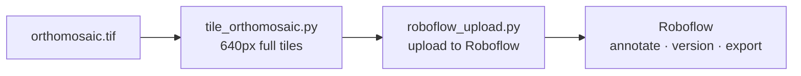

# Tornado Labeling Pipeline

**Author:** Pranay Kumar Andra | **Advisor:** Dr. Melissa Wagner

Tiles a tornado-damage orthomosaic (`.tif`) into uniform image chips and uploads
them to [Roboflow](https://app.roboflow.com) for **instance-segmentation**
annotation and dataset management.



One command does both steps:

```bash
python3 scripts/run_pipeline.py data/orthomosaic.tif
```

---

## Installation

```bash
git clone <repository-url>
cd tornado-labels-v2
conda env create -f environment.yml -n tornado-labels
conda activate tornado-labels
```

Or with pip: `pip install -r requirements.txt`.

---

## Setup: Roboflow key

Copy the template and add your private API key (`.env` is gitignored):

```bash
cp .env.example .env
# edit .env  ->  ROBOFLOW_API_KEY=...
```

| Variable | Default | Purpose |
|---|---|---|
| `ROBOFLOW_API_KEY` | — | Your private Roboflow key (required to upload) |
| `ROBOFLOW_WORKSPACE` | `tornado-ml` | Target workspace |

If no key is set, tiling still runs and the upload is skipped with a warning.

---

## Usage

Put your orthomosaic in `data/`, then run:

```bash
# tile + upload (recommended: dry-run first to check tile counts)
python3 scripts/run_pipeline.py data/site-a.tif --rf-dry-run
python3 scripts/run_pipeline.py data/site-a.tif
```

> **Big orthomosaic?** Tiling always saves the **full** set of chips to
> `outputs/tiles/`. `--max-tiles` only limits how many are **uploaded** to
> Roboflow — sampled randomly from across the whole image (not one corner) — so
> you keep the complete local dataset but push just a test sample:
>
> ```bash
> python3 scripts/run_pipeline.py data/site-a.tif --max-tiles 50 --sample-seed 0
> ```

Each run lands in Roboflow as:

- **Project:** one per dataset, named after the input file (e.g. `site-a`),
  created as an instance-segmentation project if it doesn't exist.
- **Batch:** one per run, e.g. `site-a_20260630_142210`.

### Options

| Flag | Description |
|---|---|
| `--tile-size` / `--overlap` | Tile size / overlap in px (default `640` / `160`) |
| `--tile-format` | `png` (default) or `jpg` |
| `--max-tiles N` | Upload only N tiles (sampled randomly); all tiles still saved locally |
| `--sample-seed` | Make `--max-tiles` upload sampling reproducible |
| `--skip-roboflow` | Tile only, don't upload |
| `--rf-dry-run` | Count tiles without uploading |
| `--rf-project` / `--rf-workspace` / `--rf-batch` | Override the Roboflow target |
| `--rf-project-type` | `instance-segmentation` (default) |

Tiles are written to `outputs/tiles/` with a `tiling_metadata.json`, a
georeferenced `tiles_index.geojson`, and a `pipeline_run_summary.json` alongside.

### Upload an existing tiles folder

```bash
python3 src/labeling/roboflow_upload.py outputs/tiles --project site-a
```

---

## Tiling

- **640 px tiles, 160 px overlap** by default — large enough to keep whole
  structures in one chip, which makes instance-segmentation masks clean.
- **Full tiles only** (`--min-coverage 1.0`): partial edge tiles are dropped, so
  every uploaded chip is exactly `tile_size × tile_size`.
- Blank / near-uniform / mostly-nodata tiles are filtered out automatically.
- **Geotagged for re-merging.** Every run writes `tiles_index.geojson` next to the
  tiles: a `FeatureCollection` with one WGS84 footprint per saved tile, carrying
  its pixel `window`, per-tile affine `transform`, and native `bounds`, plus the
  source CRS/transform in the header. That's enough to reassemble the tiles into a
  georeferenced mosaic later, and the footprints load directly as a layer in QGIS.
  (Disable with `--no-geojson` on `tile_orthomosaic.py`.)
- **Optional CHM / NDVI stats.** Pass `--chm PATH` and/or `--ndvi PATH` to
  `tile_orthomosaic.py` to sample each tile's footprint from the height / vegetation
  rasters (matched by geography, so differing resolutions are fine) and add per-tile
  `chm_mean/chm_max/chm_p95/chm_valid_frac` and `ndvi_mean/ndvi_veg_frac` to the
  GeoJSON — handy for filtering tiles (e.g. skip open fields, prioritise structures)
  or routing tree vs structural damage. `--ndvi-veg-threshold` sets the vegetation
  cut (default `0.3`).

  ```bash
  python3 src/labeling/tile_orthomosaic.py site_ortho.tif outputs/tiles \
    --chm site_CHM.tif --ndvi site_NDVI.tif
  ```

---

## GeoTIFF Inspector (GUI)

A minimal Streamlit app for inspecting an orthomosaic and previewing the tiling
**before** you commit to a run:

```bash
streamlit run src/gui/app.py
```

Pick a `.tif`/`.tiff` in the sidebar — choose from files discovered under
`data/`/`outputs/` (or point **Folder to scan** at wherever your orthomosaics
live), or paste an absolute path. **Very large orthomosaics (tens of GB) are read
in place** via windowed/downsampled reads, so select them by path — the browser
uploader is only a size-capped convenience for small sample files. Then explore
three tabs:

- **Metadata** — width/height, CRS + EPSG, resolution, native + lon/lat bounds,
  affine transform, NoData, per-band dtype / colour-interpretation / description,
  plus driver, compression, internal tiling + block size, overview levels and
  on-disk size.
- **Bands** — view any single band with a colormap (with min/max/mean/std and a
  histogram) or an RGB composite from chosen bands.
- **Tiles** — enter tile size / overlap and see the expected tiles along X and Y,
  the grid total, how many are full vs. dropped edge tiles, the grid overlaid on a
  downsampled preview, and a single-tile preview. A **Run tiling** button calls the
  same `tile_raster()` the pipeline uses (Roboflow upload stays on the CLI).

All previews use windowed / downsampled reads, so multi-GB GeoTIFFs are never
loaded whole into memory. The tile-count math and grid come from the tiler's own
`iter_tile_windows()` / `tile_grid()`, so the numbers shown match what a run
produces.

---

## Labeling Schema

Annotate polygons in Roboflow using the 8 classes in `schemas/classes.txt`:

| Class | Description |
|---|---|
| `Structural_Detailed_NoDamage` | No structural damage |
| `Structural_Detailed_MinorDamage` | Minor structural damage |
| `Structural_Detailed_ModerateDamage` | Moderate structural damage |
| `Structural_Detailed_MajorDamage` | Major structural damage |
| `Structural_Detailed_Destroyed` | Structure destroyed |
| `Tree_Quick_NoDamage` | No tree damage |
| `Tree_Quick_MinorDamage` | Minor tree damage |
| `Tree_Quick_MajorDamage` | Major tree damage |

Use Roboflow's smart-polygon tool to speed up annotation, then generate a dataset
version and export to YOLOv8-seg, COCO, SAM, etc.

---

## File Structure

```text
tornado-labels-v2/
├── data/                         # Input orthomosaics (.tif; gitignored)
├── outputs/                      # Tiles + metadata (auto-generated, gitignored)
├── schemas/
│   └── classes.txt               # 8-class instance-segmentation schema
├── scripts/
│   └── run_pipeline.py           # tile + upload entry point
├── src/
│   ├── gui/
│   │   ├── app.py                # Streamlit GeoTIFF inspector (streamlit run)
│   │   ├── raster_inspect.py     # metadata + memory-safe reads + rendering
│   │   └── tiling_preview.py     # tile-grid summary + overlay
│   ├── labeling/
│   │   ├── tile_orthomosaic.py   # tiling (+ tile_grid / iter_tile_windows)
│   │   └── roboflow_upload.py    # Roboflow upload
│   └── utils/
│       ├── image_utils.py        # blank-tile detection
│       └── io_utils.py           # filesystem helpers
├── tests/
├── .env.example                  # Roboflow credentials template
├── environment.yml
└── requirements.txt
```

---

## Testing

```bash
python3 -m pytest tests/ -v
```

Tests cover tiling (big/full-only) and the Roboflow upload (dry-run + mocked SDK);
no live API key or network access is required.
