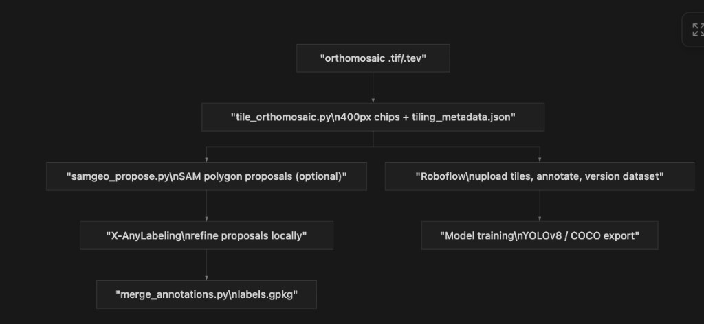

# Tornado Labeling Pipeline

**Author:** Pranay Kumar Andra | **Advisor:** Dr. Melissa Wagner

End-to-end pipeline for labeling tornado damage from orthomosaics. Accepts `.tev`/`.tif` inputs, tiles them, proposes damage polygons via SAM, and exports georeferenced GeoPackage labels after human review.



---

## Installation

```bash
git clone <repository-url>
cd tornado-labels
conda env create -f environment.yml -n tornado-labels
conda activate tornado-labels
```

Create the data directory and add your orthomosaics:

```bash
mkdir data   # place .tif or .tev orthomosaics here
```

If you plan to use X-AnyLabeling with GroundingDINO, run this once after activation:

```bash
python3 setup_groundingdino.py
```

---

## Quick Start

Place orthomosaics in `data/`, then submit via Slurm:

```bash
sbatch scripts/run_pipeline.slurm
```

Or check available options first:

```bash
python3 scripts/run_pipeline.py --help
```

Outputs go to `outputs/<dataset>/<timestamp>_job<ID>/` with a `pipeline_run_summary.json`.

---

## Manual Workflow (Local / Debugging)

```bash
# 1. Convert to TIF (if needed)
python3 src/labeling/convert_to_tif.py data/orthomosaic.tev data/

# 2. Tile the orthomosaic (default: 400px tiles, 128px overlap)
python3 src/labeling/tile_orthomosaic.py data/orthomosaic.tif outputs/tiles
# Outputs: outputs/tiles/tile_y????_x????.png + tiling_metadata.json

# 3. Generate SAM proposals (optional)
python3 src/labeling/samgeo_propose.py outputs/tiles outputs/proposals

# 4. Edit proposals with a labeling tool (X-AnyLabeling, QGIS, etc.)
#    Save annotations as GeoJSON in outputs/edited/

# 5. Merge annotations into final GeoPackage
python3 src/labeling/merge_annotations.py data/orthomosaic.tif outputs/tiles outputs/edited outputs/labels.gpkg
```

---

## Labeling Schema

Currently uses `schemas/classes.txt` (8 classes):

| Class | Description |
|---|---|
| `Structural_Detailed_NoDamage` | No structural damage |
| `Structural_Detailed_MinorDamage` | Minor structural damage |
| `Structural_Detailed_ModerateDamage` | Moderate structural damage |
| `Structural_Detailed_MajorDamage` | Major structural damage |
| `Structural_Detailed_Destroyed` | Structure destroyed |
| `Tree_Quick_NoDamage` | No tree damage |
| `Tree_Quick_MinorDamage` | Minor tree damage |
| `Tree_Quick_MajorDamage` | Major tree damage |

A more detailed schema (`schemas/labels.txt`, 60+ classes) covering structures, trees, vegetation, vehicles, debris, and land cover is planned for a future version.

---

## Labeling Tool: X-AnyLabeling

Connect with X11 forwarding, then:

```bash
# Recommended — auto-detects latest tiles directory
./run_anylabeling.sh

# Or specify paths explicitly
./run_anylabeling.sh outputs/<dataset>/<timestamp>_job<ID>/tiles schemas/classes.txt
```

SSH with X11:
```bash
ssh -YC <SSH-LOGIN-IDENTIFIER>
```

---

## Roboflow: Dataset Upload & Annotation

After tiling, upload the image chips to [Roboflow](https://app.roboflow.com) for annotation and dataset management.

**1. Create a project**

On `app.roboflow.com`, create a new project in the updated workspace.

**2. Upload tiles**

Via the web UI — drag and drop the contents of `outputs/<dataset>/<timestamp>_jobID/tiles/`.

Or via the Python SDK:

```bash
pip install roboflow
```

```python
from roboflow import Roboflow

rf = Roboflow(api_key="YOUR_API_KEY")
project = rf.workspace("YOUR_WORKSPACE").project("YOUR_PROJECT")
project.upload("outputs/<dataset>/<timestamp>_jobID/tiles/")
```

**3. Annotate**

Label polygons in Roboflow using the 8-class schema defined in `schemas/classes.txt`. Use the built-in smart polygon tool to speed up annotation or we can create classes directly on Roboflow.

**4. Version & export**

Generate a dataset version, apply augmentations as needed, then export in your target format (SAM3, YOLOv8, COCO JSON, etc.) for model training.

> The Roboflow path is independent of the local X-AnyLabeling path - use whichever fits your workflow.

---

## Output Format

Final output is a GeoPackage (`.gpkg`) with layer `tornado_damage_labels`:

- `label` — damage class
- `confidence` — optional score
- `tile` — source tile name
- `proposal_id` — SAM proposal ID (if applicable)

---

## File Structure

```
tornado-labels/
├── data/                         # Input orthomosaics
├── outputs*/                     # Pipeline artefacts (auto-generated)
│   └── <dataset>/<timestamp>_jobID>/
│       ├── tiles/                #   image chips + tiling_metadata.json
│       ├── proposals/            #   SAM-generated GeoJSONs
│       ├── edited/               #   human-reviewed GeoJSONs
│       ├── work/                 #   intermediate files (converted TIF, etc.)
│       ├── labels.gpkg           #   final georeferenced output
│       ├── requirements.lock     #   frozen env captured at run time
│       └── pipeline_run_summary.json
├── schemas/
│   ├── classes.txt               # Current label schema (8 classes)
│   ├── labels.txt                # Extended schema (60+ classes, future)
│   └── labels_schema.json
├── scripts/
│   ├── run_pipeline.py
│   ├── run_pipeline.slurm
│   ├── submit_pipeline_jobs.py
│   └── verify_pipeline_outputs.py
├── src/
│   ├── labeling/
│   │   ├── convert_to_tif.py
│   │   ├── merge_annotations.py
│   │   ├── samgeo_propose.py
│   │   └── tile_orthomosaic.py
│   └── utils/
│       ├── geo_utils.py
│       └── io_utils.py
├── run_anylabeling.sh
├── setup_groundingdino.py
├── environment.yml
└── requirements.txt
```

> `*` = gitignored

---

## Recent Changes

### Mar 2026 — Tiling overhaul
- **Parallel tiling** — `tile_orthomosaic.py` now uses `ThreadPoolExecutor` (8 workers by default) for faster tile extraction.
- **Multi-stage quality filter** — tiles are filtered in order (cheapest check first) before being saved:
  1. **Min coverage** (`--min-coverage 0.25`) — skips edge tiles smaller than 25% of the target area
  2. **Nodata fraction** (`--max-nodata-fraction 0.5`) — skips tiles with >50% masked/nodata pixels
  3. **Blank detection** (`--blank-threshold 0.95`, `--variance-threshold 1e-4`) — skips near-uniform, all-white, or all-black tiles; optional Laplacian sharpness filter (`--sharpness-threshold`, disabled by default)
- **Tiling metadata** — `tiling_metadata.json` is written to the tiles directory with counts, parameters, and filter settings; used downstream by `merge_annotations.py` to recover tile origins.

